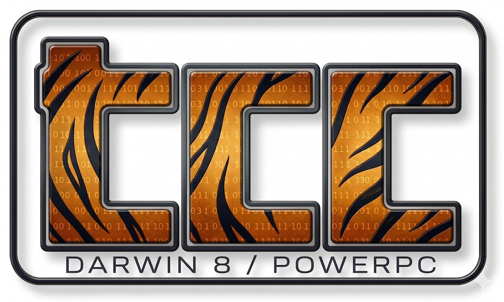

# tcc-darwin8-ppc



A Mac OS X 10.4 Tiger / PowerPC backend for [tcc](https://repo.or.cz/tinycc.git),
the Tiny C Compiler.

**Status: v0.2.7-g3 SHIPPED.** TCC has never had a PowerPC backend
in any release. As of session [027](docs/sessions/027-self-link/README.md),
the entire bootstrap chain runs without `gcc-4.0`: tcc compiles AND
links `tcc-self`, which compiles AND links `tcc-self2`, which
produces a `.o` byte-identical to what `tcc-self3` produces — the
canonical self-host fixpoint, on a 22-year-old G3 / G4. The
[v0.2.7-g3](https://github.com/cellularmitosis/tcc-darwin8-ppc/releases/tag/v0.2.7-g3)
patch release ([035](docs/sessions/035-unsupervised-2026-05-02/README.md))
makes **`tcc -run` actually work on PPC for the first time**:
`create_plt_entry` + `relocate_plt` now generate proper
lis/ori/mtctr/bctr branch islands that JIT-resolve every libc call
through dlsym. `tests2` baseline holds at **104 / 118 (88.1%)**
under the default `-o exe` path, and a separate `RUN=1` mode
exercises the `-run` JIT and lands at 102 / 118 (86.4%). A ~150 KB
`/opt`-installable tarball is built end-to-end by
`scripts/build-release-tarball.sh`.

## Status

| | |
|---|---|
| ✅ | Source base chosen: [mob branch @ b39da9f6](tcc/.UPSTREAM.md) |
| ✅ | Architecture & licensing surveyed ([000](docs/sessions/000-source-survey/README.md), [001](docs/sessions/001-fork-comparison/README.md)) |
| ✅ | Baseline builds verified on uranium (host) and imacg3 (target) ([002](docs/sessions/002-baseline-build/README.md)) |
| ✅ | Backend scaffold — `tcc` builds, runs, preprocesses ([003](docs/sessions/003-backend-scaffold/README.md)) |
| ✅ | First real PPC instructions emitted, hand-verified ([004](docs/sessions/004-prolog-epilog-return/README.md)) |
| ✅ | **`tcc -run` executes PPC code on G3, exit codes propagate** ([005](docs/sessions/005-macho-stubs/README.md), [demo](demos/s005-return-the-answer.c)) |
| ✅ | Local variables, assignment, arithmetic, branches ([006](docs/sessions/006-locals-arith-control/README.md), [demo](demos/s006-factorial.c)) |
| ✅ | Function calls — direct, indirect, recursive, up to 8 int args ([007](docs/sessions/007-function-calls/README.md), [demo](demos/s007-fibonacci.c)) |
| ✅ | Pointers, arrays, modulo ([008](docs/sessions/008-pointers-modulo/README.md), [demo](demos/s008-array-sum.c)) |
| ✅ | **Real PPC Mach-O `.o` output, links with gcc, runs on G3** ([009](docs/sessions/009-tccmacho-ppc/SESSION_README.md), [demo](demos/s009-real-macho.sh)) |
| ✅ | Long long arithmetic, args, return ([010](docs/sessions/010-long-long/README.md), [demo](demos/s010-long-long.c)) |
| ✅ | Structs (member access, pass-by-pointer) ([011](docs/sessions/011-structs/README.md), [demo](demos/s011-struct.c)) |
| ✅ | Varargs (`<stdarg.h>`, `va_start`/`va_arg`/`va_end`) ([012](docs/sessions/012-varargs/README.md), [demo](demos/s012-varargs.c)) |
| ✅ | IEEE 754 single + double floating point ([013](docs/sessions/013-floating-point/README.md), [demo](demos/s013-floating-point.c)) |
| 🟡 | **Bootstrap attempt: every tcc source file compiles to .o with our tcc** ([014](docs/sessions/014-bootstrap-attempt/README.md)) — 2 codegen gaps + 1 macho bug remain before self-host links |
| 🟡 | **Bootstrap link: 11/11 .o files link to a 463KB tcc-self binary** ([015](docs/sessions/015-bootstrap-gaps/README.md)) — needs PLT stubs to actually run |
| ✅ | **PPC PIC stubs — tcc-emitted `printf` works** ([016](docs/sessions/016-ppc-plt-stubs/README.md), [demo](demos/s016-hello-printf.sh)) |
| ✅ | External-data PIC indirection — `errno` etc. work end-to-end ([017](docs/sessions/017-extern-data-pic/README.md)) |
| ✅ | **`tcc-self -v` runs** — bootstrap binary executes ([018](docs/sessions/018-tcc-self-sigbus/README.md)) |
| ✅ | **BE long-long handling fixed — tcc-self compiles real programs** ([019](docs/sessions/019-be-ll-fixes/README.md)) |
| ✅ | **🎉 SELF-HOST FIXPOINT — tcc-self2 compiles tcc.c into a byte-identical .o** ([020](docs/sessions/020-self-host/README.md)) |
| ✅ | Self-contained self-host (libtcc1.a bundles `__floatundidf`; predefined `__FLT_EVAL_METHOD__`) ([021](docs/sessions/021-libtcc1-and-predefs/README.md)) |
| ✅ | **`v0.1.0-g3` tarball — `/opt`-installable, ~146 KB, verified on iMac G3** ([022](docs/sessions/022-v0.1.0-g3-release/README.md)) |
| 🟡 | Mach-O exec output — `tcc -o exe` works for syscall-only programs ([023](docs/sessions/023-macho-executable/README.md)); libSystem stdio needs crt1 |
| 🟡 | EXE writer extended: extern-data PIC, `__data` section, auto-injected `__tcc_start_main`, `__mh_execute_header`, `LC_TWOLEVEL_HINTS` ([024](docs/sessions/024-libsystem-init/README.md)) — libSystem init still elusive |
| ✅ | **Mach-O `.o` reader → full self-link via tcc** — auto-loads `/usr/lib/crt1.o`, `tcc -o exe` produces working printf/malloc binaries with no gcc involvement ([025](docs/sessions/025-macho-o-reader/README.md)) |
| 🟡 | **libgcc helpers bundled in `libtcc1.a`** — 10 helpers for long-long arithmetic, IEEE 754 conversions ([026](docs/sessions/026-libgcc-helpers/README.md)); blocked from full self-link by a Tiger keymgr/DWARF init-order bug |
| ✅ | **🎉 FULL SELF-LINK & SELF-HOST FIXPOINT — `gcc-4.0` no longer needed for the bootstrap chain.** `bootstrap-tcc-self.sh` produces a working `tcc-self` linked entirely by `tcc` itself, then verifies tcc-self2 → tcc-self3 byte-identical fixpoint ([027](docs/sessions/027-self-link/README.md)) |
| ✅ | **`v0.2.0-g3` release tarball — `/opt`-installable, ~141 KB, fully self-hosted, verified on iBook G4** ([028](docs/sessions/028-v0.2.0-g3-release/README.md)) |
| ✅ | **TCC `tests2/` baseline — 70 / 122 pass (57%)** ([029](docs/sessions/029-tests2-baseline/README.md)); `scripts/run-tests2.sh` for one-command re-runs |
| 🟡 | **sqlite3 amalgamation smoke** ([030](docs/sessions/030-sqlite-smoke/README.md)) — compiles 53K lines past initial blockers; remaining blocker is struct-by-value parameters |
| 🟡 | **Fixpoint regression deep-dive** ([031](docs/sessions/031-fixpoint-investigation/README.md)) — root cause documented (64-bit const-fold sign-ext); partial fix landed in same session |
| ✅ | **`v0.2.1-g3` patch release** ([032](docs/sessions/032-v0.2.1-release/README.md)) — `>8-arg fns`, `TOK_PDIV`, FP shadow for variadic, dylib loading, header guards. tests2 jumps to 75 / 122 (62%) |
| ✅ | **`v0.2.2-g3` patch release** ([033](docs/sessions/033-v0.2.2-release/README.md)) — 3 more libgcc helpers (`__floatdidf`, `__fixdfdi`, `__ashldi3`), auto-link libtcc1.a for PPC EXE. tests2: 77 / 122 (63%) |
| ✅ | **`v0.2.3-g3` patch release** ([035](docs/sessions/035-unsupervised-2026-05-02/README.md)) — **struct-by-value parameters** (Apple PPC ABI), EXE PIC reloc loop fix, VT_BOOL/ggoto/void-deref, `__eprintf`, tests2 capture-fix. tests2 jumps to 87 / 122 (71%) |
| ✅ | **`v0.2.4-g3` patch release** ([035](docs/sessions/035-unsupervised-2026-05-02/README.md)) — **struct returns** (hidden pointer), dynamic param-area sizing, big-endian sub-word param offset, FP-to-LL helper return swap, absolute-address load/store, no-op bound-check + atomic stubs, Tiger realpath workaround. tests2 jumps to **96 / 122 (79%)** |
| ✅ | **`v0.2.5-g3` patch release** ([035](docs/sessions/035-unsupervised-2026-05-02/README.md)) — **long-frame prolog/epilog** (>32KB stack frames), long-offset local load/store, **VLAs** (variable-length arrays), `.init_array → __mod_init_func` classification (for .o output). tests2 jumps to **101 / 122 (83%)** |
| ✅ | **`v0.2.6-g3` patch release** ([035](docs/sessions/035-unsupervised-2026-05-02/README.md)) — **constructor / destructor support** (full EXE side: `__mod_init_func` + `__mod_term_func` emission, with a `sects[8]→[16]` overflow fix that was hanging tcc on `108_constructor`), **VLA × callee param-spill safety buffer** (fixes `79_vla_continue`), and BE-aware skips for 4 inherently-LE tests. tests2 jumps to **105 / 118 (89%)** |
| ✅ | **`v0.2.7-g3` patch release** ([035](docs/sessions/035-unsupervised-2026-05-02/README.md)) — **`tcc -run` works on PPC for the first time**: `create_plt_entry` / `relocate_plt` generate lis/ori/mtctr/bctr branch islands, R_PPC_JMP_SLOT / R_PPC_GLOB_DAT relocs write resolved addresses big-endian into the GOT, and a tcc-internal stub catches libtcc1.a's lazy-binding scaffolding when it would otherwise SEGV. Critical bug found and fixed during implementation: the lis+ori sequence must use `@hi`, not `@ha`, since `ori` is zero-extending. tests2 holds at 104 / 118 under `-o exe`; new `RUN=1` mode lands at 102 / 118 (86.4%) |

[Roadmap](docs/roadmap.md) • [Sessions](docs/sessions/) • [Demos](demos/README.md)

## What this project is

TCC ships with backends for i386, x86_64, ARM, ARM64, C67, and
RISC-V64. **It has never had a PowerPC backend** in any release
(Bellard's, the 0.9.27 community release, or the active mob branch).
This project adds one, targeting 32-bit PowerPC on Mac OS X 10.4
Tiger Mach-O.

In addition to the codegen, this requires extending TCC's
`tccmacho.c` (currently hardcoded for x86_64 and arm64) to emit
32-bit PPC Mach-O object files and dyld-compatible executables.

## Why

- TCC compiles fast, in a place where everything else is slow.
  GCC takes minutes on a G3; even a quarter-functional TCC could
  meaningfully speed up small builds on the platform.
- Self-hosting a from-scratch compiler backend on a 22-year-old
  machine is fun.
- PowerPC ISA is genuinely pleasant — a fixed-size 32-bit
  instruction set with a clean RISC dispatch model.

## Building (G3 / G4, Tiger)

Primary dev host is **`ibookg37`** (300 MHz faster than the iMac G3
the project started on; both run Tiger 10.4.11 with the same gcc-4.0
+ libSystem + dyld).

```sh
ssh ibookg37
git clone <this-repo> ~/tcc-darwin8-ppc
cd ~/tcc-darwin8-ppc/tcc
./configure --config-semlock=no
/opt/make-4.3/bin/make           # system make is GNU 3.80, lacks $(or)
./tcc -B. -run hello.c           # works for "int main(void) { return N; }"
```

Notes:
- `--config-semlock=no` is required: tcc.h's `__APPLE__` branch
  hardcodes Grand Central Dispatch (10.6+); Tiger has POSIX
  semaphores only. The semlock feature isn't needed for our use.
- System `make` is GNU 3.80 (2002), which doesn't support `$(or
  ...)`. Use `/opt/make-4.3/bin/make` (preinstalled on the
  PowerPC fleet via `tiger.sh`).

## Building (uranium, host build for sanity check)

```sh
cd tcc
./configure
make -j8        # builds an arm64-osx tcc, has nothing to do with PPC
                # but confirms our patches don't break upstream targets
```

## Layout

```
tcc/                     - upstream mob source, modified in place. No
                           patch-set workflow. tcc/.UPSTREAM.md notes
                           the snapshot commit.
  ppc-gen.c              - PPC32 code generator (we wrote this).
  ppc-link.c             - PPC32 ELF relocation handling (we wrote).
  ppc-macho-stubs.c      - integration shims while tccmacho.c lacks
                           PPC support; deleted when phase 3 lands.
docs/
  roadmap.md             - phases and per-session breakdown.
  sessions/NNN-<slug>/   - per-session narrative + findings.
```

## Sister projects

(Currently private. Will cross-link once they're public.)

## License

Project code is MIT-licensed. The `tcc/` subdirectory inherits
upstream TCC licensing — LGPL 2.1 with most files MIT-relicensed
per [`tcc/RELICENSING`](tcc/RELICENSING). A handful of files
(notably `arm-gen.c`) remain LGPL-only; we don't copy from those.

See [`tcc/COPYING`](tcc/COPYING) and
[`tcc/RELICENSING`](tcc/RELICENSING) for upstream details.
